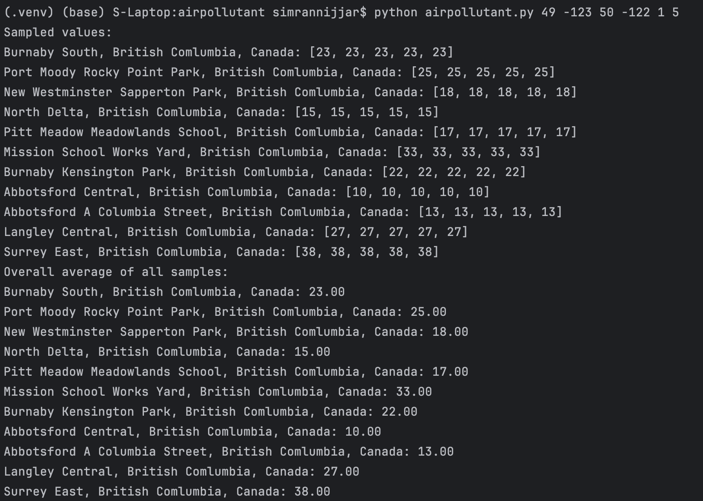

# Air-Pollutant

This is Python command line program that calculates the average of air pollutant PM2.5 over n minutes,
of all the stations map bound by two pairs of latitude and longitude.

### Input

The command line program takes the following values as input:
- two pairs of (latitude, longitude)
- sampling period in minutes
- sampling rate in sample(s)/minute

### Data

The data is taken from https://aqicn.org/json-api/doc/ API

### Output

The output prints the PM2.5 sampled value for each station and the overall PM2.5 average of all stations over n minutes of sampling.

### How to run

Type the following command into the terminal (these are the latitude and longitude for Vancouver, BC and Burnaby, BC):
```
python airpollutant.py 49 -123 50 -122 1 5
```

### Example output

Using the example command, the following is an example result:


